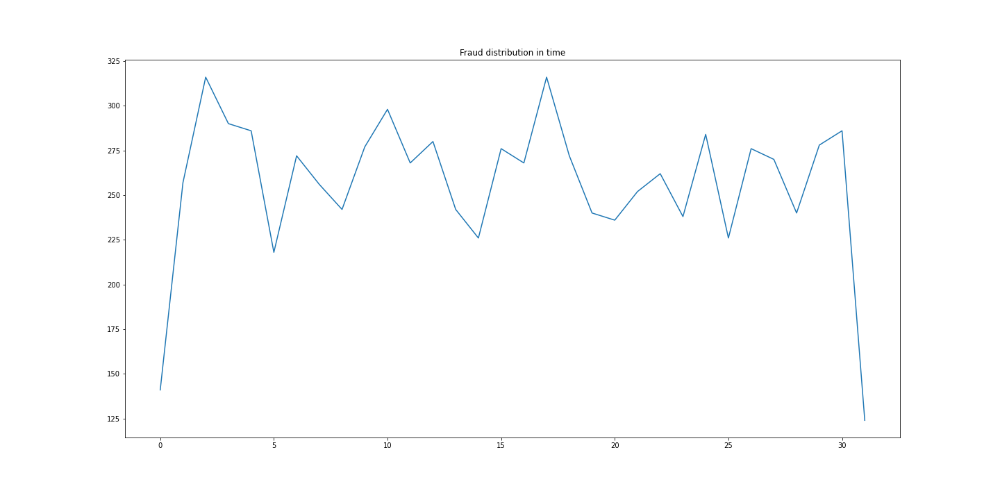
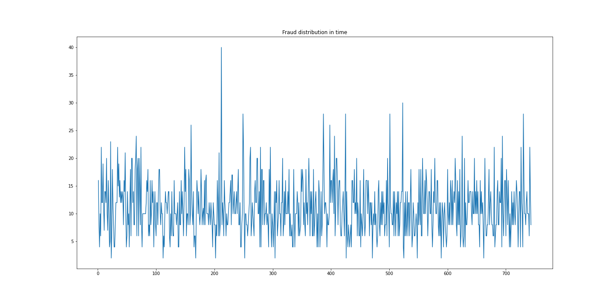

# Transaction Fraud Detection 
Fraud is a global economic menace which threatens the survival of individuals, firms, industries and economies, and the mobile money service is no exception. 
In this analysis we explore a synthetic dataset, related to a mobile money service. Our goal is to investigate the performance of machine learning models on an highly skewed dataset. 

## 1 Overview
Financial Fraud detection systems are challenging due two major reasons: i) fraudulent behaviours can follow different schemas; ii) fraudulent transactions are very rare.

In this analysis we focus on PaySIM [[1]](https://www.researchgate.net/publication/313138956_PAYSIM_A_FINANCIAL_MOBILE_MONEY_SIMULATOR_FOR_FRAUD_DETECTION) dataset. It is a synthetic dataset constructed using an agent based simulation approach [[2](https://link.springer.com/article/10.1007/s10100-011-0210-y)]. In particular, PaySim simulates mobile money transactions based on a sample of real transactions extracted from the logs of a mobile money service implemented in an African country.

The analysis is structured as follows:  **Section 2.** presents an explorative analysis of the dataset; **Section 3**. focuses on data enrichment, dimensionality reduction and data transformation; **Section 4**. addresses the unbalanced dataset problem; **Section 5**. compares performances of a SVM classifier on different dataset configurations

## Exploratory Data Analysis

The dataset contains 6.362.620 transactions. Only 8213 transactions are labeled as fraudulent (i.e. 0.1%). 

There are 6.589.578 unique clients. Most clients do one transaction per month and only few than 1% of clients transact more. Moreover, each defrauded clients has at most one transaction labeled as fraud. This means that the dataset doesn't contain complex schemas of frauds. 

Fraudulent transactions can be only of type `CASH-OUT`  (4116 transactions) and `TRANSFER` (4097 transactions). Therefore, frauds can be a one shot transfer to a mule account or a single withdraw cash from a merchant. 
For this reason, the mean amount of fraudulent transactions is higher that the mean of normal transactions.

Fraudulent transactions are equally distributed in the time. There is an average of 256 fraudulent transactions per day (11 per hour).  The highest peaks are at days 2, 10 and 17.



If we aggregate per hour, it is possible to see that frauds are still equally distributed.  The highest peak is at step 212 (day 9) with 40 transactions.




About 32% of transactions has both fields `oldbalanceOrg` and `newbalanceOrig` equal to zero. Maybe those transactions are not accepted by the system or negative balances are set to 0. The same phenomenon is present in  the fields `oldbalanceDest` and `newbalanceDest`.
Moreover, if we analyze the fields  `oldbalanceDest` and `newbalanceDest` of clients (merchants) having multiple incoming transaction,  it is possible to note that doesn't exist a correlation between these attributes.
If we consider for example all incoming and outgoing transactions for client *C716083600* at step *1*, the value of `oldbalanceDest` change for each transaction. The same is not for the `newbalanceDest`, that is always the same except for the last row. 

## 3 Dataset Manipulation

### 3.1 Data Enrichment
We enrich each transaction with information about the spending behaviour of source and destination clients: the number of outlinks of a client (inlink of a merchant); the average amount of client outlinks (merchant inlinks).

In particular, we add the following features:
- **countOrigStep**:number of outgoing transactions made by `nameOrig` at `step` 
- **countOrig**: number of outgoing transactions made by `nameOrig`
-  **countDestStep**: number of incoming transactions made by`nameDest` at `step` 
- **countDest**: number of incoming transactions made by`nameDest` 
- **avgAmtOrigStep**: average amount of outgoing transactions made by`nameOrig` at `step` 
- **avgAmtOrig**: average amount of outgoing transactions made by `nameOrig`
-  **avgAmtDestStep**: average amount of incoming transactions made by`nameDest` at `step` 
- **avgAmtDest**: average amount of of incoming transactions made by`nameDest` 
- **is_CASH_OUT**: is True if `type` is `CASH_OUT`
 
### 3.2 Dimensionality Reduction

We remove all data records having the following properties:
- The transaction type is `DEBIT` and `CASH_IN`;
-  `nameDest` starts from `M`. 

The filtered dataset is composed by 2.770.409 data records. It represents the 43% of the whole dataset.

### 3.3 Feature Scaling
Feature Scaling makes sure that the features of the data-set are measured on the same scale.
We apply z-score normalization to all numeric features related to the transactions amount and the number of outlinks/inlinks of a client

### 3.4 Feature Selection
The final dataset is composed by the features described in Section 3.1 and the following original features:
- `step`:  (z-score);
- `amount`:  (z-score);
- `oldbalanceOrg`:  (z-score);
- `newbalanceOrg`:  (z-score);
- `oldbalanceDest`: (z-score);
- `newbalanceDest`:  (z-score);
- `avgAmtOrigStep`: (z-score);

## Handling Unbalanced Dataset
 The main challenge of Financial Fraud Detection is that datasets are highly skewed. The performance of detection model is greatly affected by the sampling approach on dataset.  

In this analysis we focus on some state-of-art  approach.  

### Undersampling 
Undersampling techniques remove examples from the training dataset that belong to the majority class in order to better balance the class distribution, such as reducing the skew from a 1:100 to a 1:10, 1:2, or even a 1:1 class distribution.
The main drawback of undersampling is the information loss due the reduction of data points.

We apply two undersampling approaches: 

#### Tomek Links
Undersampling through Tomek links [[4](https://ieeexplore.ieee.org/document/4309452)] consists into removing the instances of the majority class in the way to increases the space between the two classes, facilitating the classification process.

In our case, Tomek Links Undersampling is able to remove only 1000 of data records. 
#### Near Miss Undersampling
Use KNN to select most representative data points.
There are three different types of sampling:
- NearMiss1: selects the examples from the majority class having the smallest average distance from three closest examples of minority class. 
- NearMiss2: selects the examples from the majority class  having the smallest average distance from three farthest examples of minority class. 
- NearMiss3: for each example of minority class, a sample of closest examples of majority class is extracted (to be sure that all positive points is surrounded from some negative example). 

### Oversampling
Unlike Undersampling, oversampling algorithms increase the size of the minority class.

Oversampling does not increase information but, it does increase the the misclassification cost of the minority examples. As drawback it increases the likelihood of overfitting since it replicates the minority class events.

#### SMOTE
SMOTE generate examples based on the distance of each data (usually using Euclidean distance) and the minority class nearest neighbors, so the generated examples are different from the original minority class.


In short, the process to generate the synthetic samples are as follows.

- Choose random data from the minority class.
- Calculate the Euclidean distance between the random data and its k nearest neighbors.
- Multiply the difference with a random number between 0 and 1, then add the result to the minority class as a synthetic sample.
- Repeat the procedure until the desired proportion of minority class is met.

The original paper on SMOTE suggested combining SMOTE with random undersampling of the majority class.

### Hybrid Sampling
Hybrid algorithms combine both undersampling and oversampling. 
In our analysis, like the SMOTE authors suggest, we apply the following hybrid approach:
	- Random undersampling (200.000 data points)
	- Smote oversampling
In this way we obtain a balanced sample of size 400.000

## Classification Algorithms

Since our goal is how the performances of a Machine Learning model can change, using different data sample approach we will learn the following models:

- SVM on balanced dataset
- SVM on unbalanced dataset, forcing the model to penalize mistakes on the minority class by an amount proportional to how underrepresented it is.
- One Class SVM fitted on a random sample of the majority class.

Unlike a standard SVM, One Class SVM is fit in an unsupervised manner and does not provide the normal hyperparameters. Instead, it provides a hyperparameter `nu` that controls the sensitivity of the support vectors and should be tuned to the approximate ratio of outliers in the data.

A SVM is a machine learning model that finds a hyperplane in an N-dimensional space (N — the number of features) that distinctly classifies the data points. 
Among all possible hyperplanes, SVM learn the hyperplane having the maximum margin, i.e the maximum distance between data points of both classes.

SVM works relatively well when there is a clear margin of separation between classes. However, if data points are not linearly separable, a kernel functions can be used. A Kernel function, is a similarity function that measure the distance of data points into a feature space with higher dimension. Data points in this feature space are linearly separable.
For time reasons, applying kernel functions on SVM and comparing performances is out of scope of the analysis.


## Results
For a time reason, we apply 10 Cross Validation only to the SVM trained on undersampled dataset with NearMiss3. 
In all the other cases, we split the input dataset in Training set (70%) and Testing Set (30). Sampling is stratified wrt `isFraud` feature to be sure that classes are equally represented.

### Metrics
- **Recall (True Positive Rate)** computes the percentage of correctly identified frauds;
- **Precision** that is the proportion of TP over the transactions ranked as frauds;
- **F1 score** : harmonic mean between precision and recall;
- **False Positive Rate (FPR)** computes the percentage of legitimate transactions that are wrongly identified as fraud;
- **Matthews correlation coefficient (MCC)**: measures the quality of the detection rate in terms of the correlation coefficient between the observed and predicted classifications (ranking); a coefficient of +1 represents a perfect ranking, 0 no better than random prediction and −1 indicates total disagreement between prediction and observation. MCC produces a more informative and truthful score in evaluating binary classifications of unbalanced datasets.
- **Receiver Operating Characteristic (ROC)** that express the ratio between the TPR and the FPP
- **training time** required to learn the model.

A Good financial fraud model should be characterized by:
-  a high True Negative Rate, since fraudulent transactions increase the operative risk of the money service company.
- a high True Positive Rate, since we want block only fraudulent transactions without blocking the normal operativity of the client.

#### Results
The following feature shows the performances of a SVM model learned on different dataset configurations:
- *SVM on unbalanced DF (2M)*: the SVM il learned on the whole dataset but a higher misclassification cost is given to the minority class.
- *SVM on SMOTE DF (400k)*: The input dataset is sampled using an hybrid approach. First the majority class is randomly undersampled (200k), then new data points of the minority class are generated using SMOTE. The final balanced dataset is composed by 400k elements.
- *SVM on NearMiss3 (16k)*: The input dataset is undersampled using NearMiss3 algorithm.  The final balanced dataset is composed by 16k data points.
- *One Class SVM (200k)*: The majority class is randomly sampled (200k). The model is learned using only the majority class. The test set is composed by 16k data points equally distributed between the two classes.

```markdown
| Metrics             | SVM on unbalanced DF (2M) | SVM on SMOTE DF (400k) | SVM on NearMiss3 (16k) | One Class SVM (200k) |
|---------------------|---------------------------|------------------------|------------------------|----------------------|
| Precision           | 0.55                      | 0.92                   | 0.80                   | 0.54                 |
| Recall              | 0.93                      | 0.92                   | 0.77                   | 0.54                 |
| F1                  | 0.58                      | 0.92                   | 0.76                   | 0.54                 |
| MCC                 | 0.29                      | 0.84                   | 0.57                   | 0.11                 |
| ROC AUC             | 0.93                      | 0.97                   | 0.84                   | 0.57                 |
| training time (sec) | 540                       | 64                     | 1.4                    | 780                  |
```


